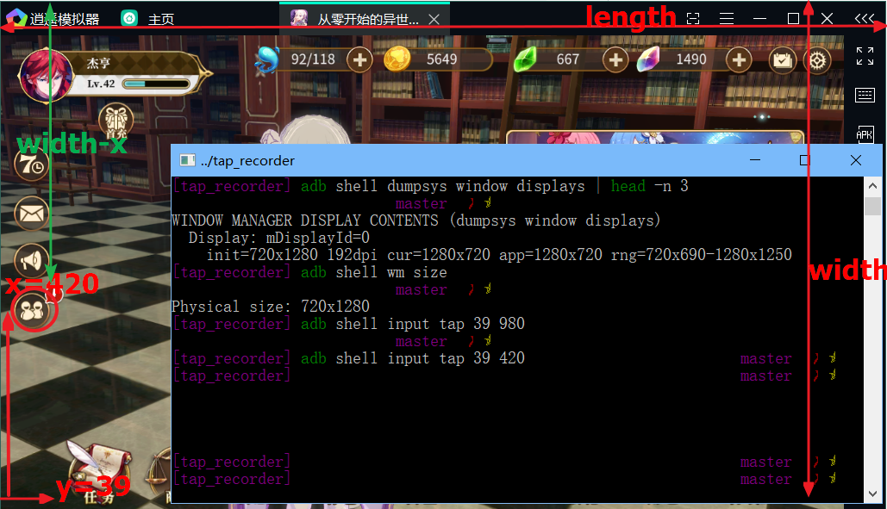

# 介绍
Android手机的模拟用户点击操作的脚本，基于adb实现，能够记录用户对手机屏幕的点击坐标和时间，然后自动重复刚才记录的点击操作。

可以用于各种需要用户重复点击手机的场合，比如，作为“明日方舟”外挂，自动刷本(对，我写这个就是用来完“明日方舟”的:-)

在WSL环境下测试，WSL下使用lsusb无法检测到手机，adb指令无法使用，因此改用Windows下的adb，而脚本仍然是Linux shell。

# 用法
1. 保证手机开启USB调试功能，并连接电脑。
2. 首先确保系统已经安装adb，并且可以使用，测试方法如下，如显示如下内容表示已adb已经连接手机。

  ```bash
  $ adb devices
  List of devices attached
  c3440aa3        device
  ```
  1.2. 可参考[连接逍遥安卓模拟器](https://github.com/jahentao/fgo-bot/blob/master/adb.md#%E8%BF%9E%E6%8E%A5-%E9%80%8D%E9%81%A5-%E6%A8%A1%E6%8B%9F%E5%99%A8)
  
  ```bash
  $ cd /mnt/g/Microvirt/MEmu
  $ export PATH=$PATH:$(pwd)
  $ alias adb=adb.exe

  $ adb connect 127.0.0.1:21503
  connected to 127.0.0.1:21503
  $ adb devices
  List of devices attached
  127.0.0.1:21503 device
  ```
  
  逍遥安卓模拟器，设置分辨率：平板（1920 * 1080 (288dpi)）

3. 进行点击记录，执行以下命令，其中filename为记录坐标的文件名
  ```bash
  $ ./tap_recorder.sh -r <filename>
  ```

4. 读取坐标文件，模拟用户点击，执行以下命令，其中filename为刚才记录的坐标文件，time为需要重复的次数
```bash
$ ./tap_recorder.sh <filename> <time>
```

PS: 目前只支持横屏模式，屏幕宽度为1080像素，不同手机需要修改，竖屏需要改脚本

PPS: 坐标记录可能会漏掉，不过脚本会自动跳过无效记录

坐标横屏后的计算


